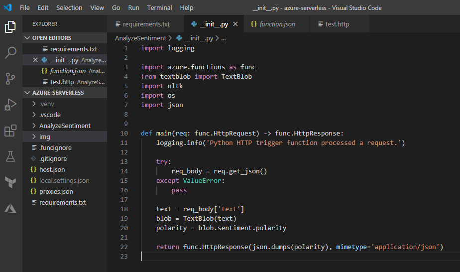
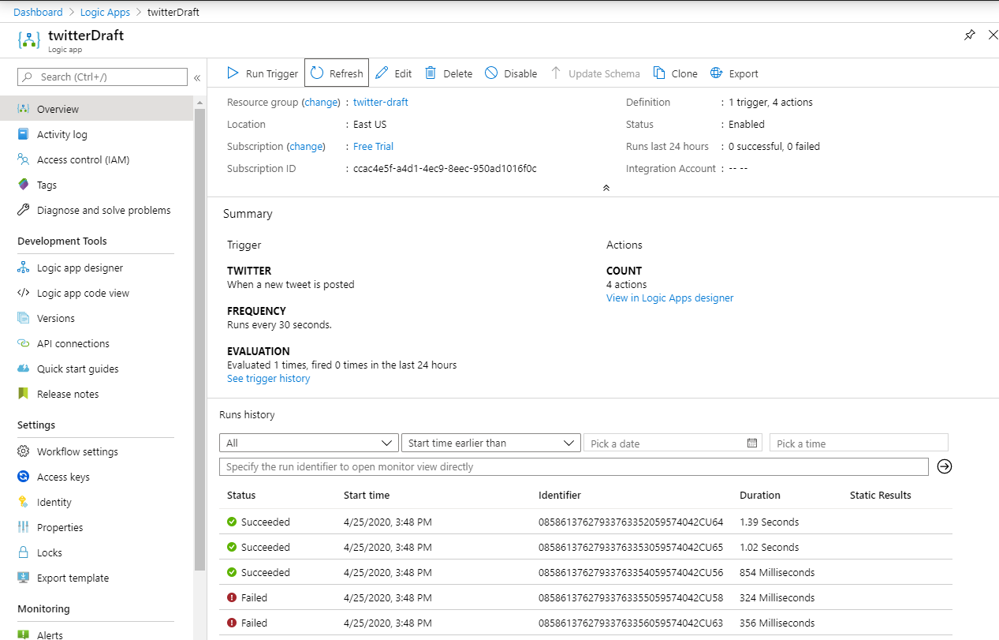
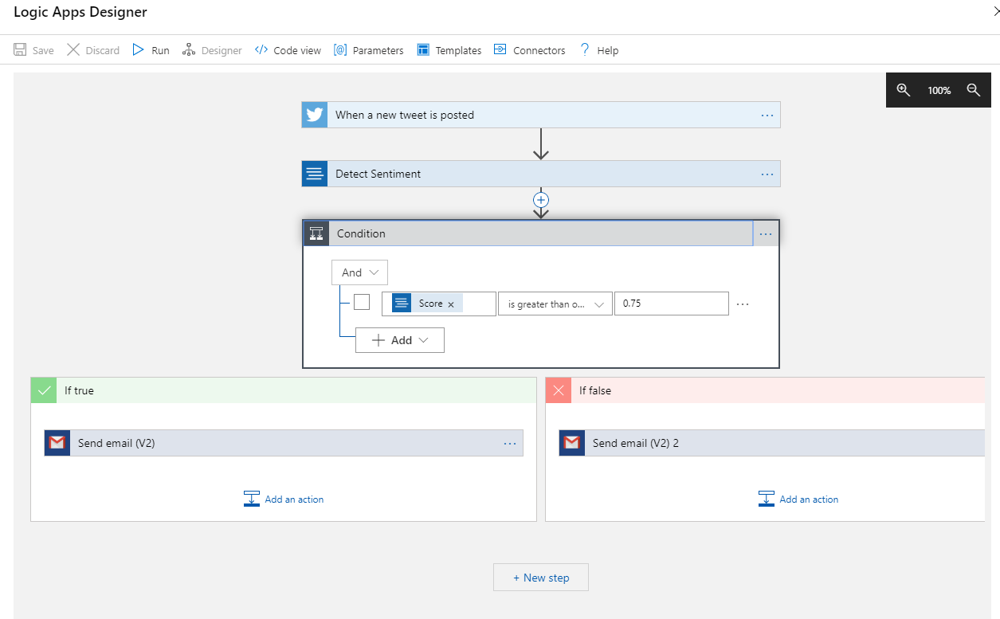
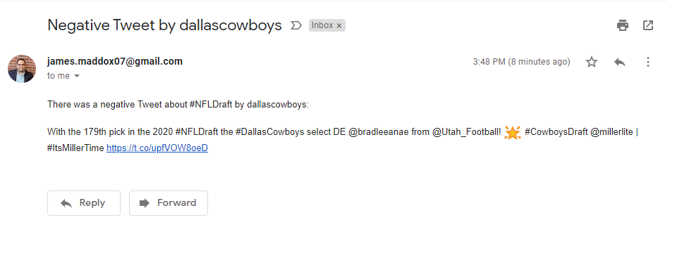
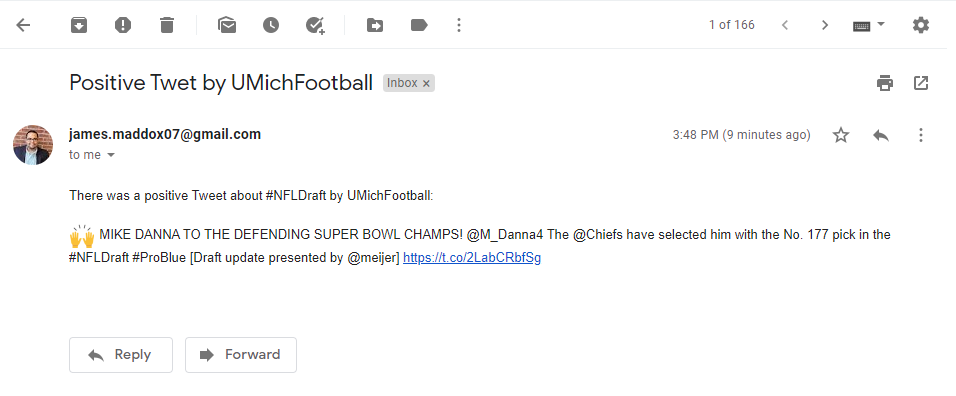

## Azure Function Demo

I used an Azure Function to pull tweets with the hashtag #NFLDraft and then sends an email to my personal email based on the sentiment score.

Function declaration:  
  
   
  
  
  
   
  
  
  
